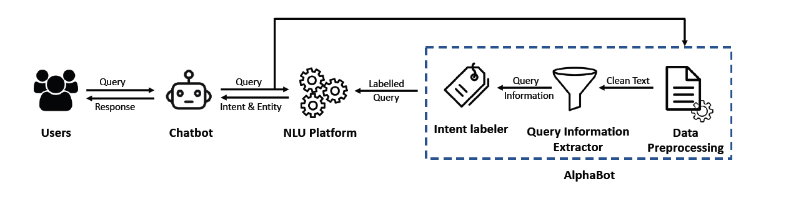

<h2>AlphaBot :The Smart Solution for Smarter Software Chatbots </h2>

Training chatbots to handle **software engineering (SE)** queries presents unique challenges due to the technical and domain specific nature of the field. Unlike general conversational AI, SE chatbots must accurately interpret specialized terms like “bug” (software defect) or “commit” (code changes). These terms carry precise meanings within the context of software development, making them difficult to process with standard methods. 

A significant bottleneck in building SE chatbots is the creation of high-quality labeled datasets required for training **Natural Language Understanding (NLU)** models. This process is both time consuming and resource intensive, as it relies heavily on domain experts to manually annotate data. To overcome this, AlphaBot introduces an innovative solution: automating data annotation using weak supervision. This machine learning technique leverages rules and heuristics to programmatically label data, significantly reducing manual effort while preserving accuracy. 

**Addressing Data Labeling Challenges in SE Chatbots** 

SE chatbots rely on NLUs to classify queries into intents and extract key entities. This task is particularly complex for SE related queries.For example:  

  Query: “Who closed issue #45?”    
  Query: “How many commits were made last week?”  

Interpreting such queries requires datasets that accurately reflect SE specific concepts, such as "pull requests," "issues," and "repositories." Traditional dataset generation methods often fail to capture the contextual intricacies of these terms. AlphaBot addresses this challenge by streamlining the labeling process through automation, ensuring the nuanced understanding required for SE chatbots without compromising on quality.

**AlphaBot’s Workflow** 

 **1- Data Preprocessing:** AlphaBot begins by cleaning raw input to reduce noise and improve the accuracy of intent classification: **Removes platform-specific tags (e.g., Slack user IDs)** These tags are irrelevant to the query’s meaning and can confuse the labeling process.  
- **Expands contractions (e.g., “don’t” to “do not”):** Expanding contractions ensures the labeling functions can correctly match keywords and patterns in the text.  
- **Standardizes text:** By normalizing formatting,  such as ensuring consistent capitalization and punctuation, AlphaBot minimizes variability that could disrupt accurate intent detection.  

**2- Query Information Extraction:** AlphaBot extracts key features to enhance labeling accuracy and ensure the correct intent is identified for each query:  
- **Entities:** Details like file names (e.g., bridge.py), issue numbers (e.g., #123), or timeframes (e.g., yesterday) are critical because they provide specific context that helps narrow down the query’s intent. For instance, the presence of a file name might indicate a query related to file management.  
- **Part-of-Speech (POS) Tags:** These tags help differentiate the roles of ambiguous terms like "commit," which could be a noun (e.g., "List the commits") or a verb (e.g., "Who committed changes?"). Identifying the correct role prevents misclassification.  
- **Question Type:** Detecting whether a query starts with "Who," "What," or "How" helps signal its specific intent, such as identifying a person, retrieving information, or explaining a process. This distinction ensures that the query is routed to the appropriate intent category.  

**3- Intent Labeling:** Using **Snorkel**, an advanced weak supervision framework, AlphaBot applies Labeling Functions (LFs) to assign intents to queries. Snorkel allows developers to programmatically  create and manage training datasets by using LFs small, rule-based scripts that label data   points based on predefined patterns or conditions. This approach significantly reduces the   need for manual labeling while maintaining accuracy.  

For example, a query containing keywords like "commits" and "last week" would be labeled as CommitsCount. If no LF matches a query, Snorkel flags it for manual review, enabling developers to refine existing LFs or add new ones, ensuring continuous improvement in AlphaBot's performance.  

**Impact of AlphaBot** 

AlphaBot was tested on the AskGit dataset, which consists of 749 queries distributed across 52 different intents. The dataset includes a variety of real-world questions related to Git and software development, offering a diverse set of examples for testing natural language understanding (NLU) models. The results demonstrated AlphaBot's efficiency and accuracy:  

- **Accuracy:** AlphaBot correctly labeled over 99% of the queries.  
- **Efficiency:** Automated labeling reduced annotation time from hours to mere seconds.  
- **Impact:** Training an NLU with AlphaBot-labeled data improved F1-scores by up to 35%, especially when the training dataset was small.  
For instance, using just 10% of the dataset for training, AlphaBot significantly improved the NLU’s F1-score from 33.87% to 69.44%, highlighting its ability to enhance performance even with limited training data.  
 

**What is Next for AlphaBot?**   

AlphaBot will expand to support new platforms, such as Bitbucket, and additional intents. It will also integrate mechanisms to learn from misclassified or ambiguous queries, ensuring continuous improvement. 

By automating one of the most labor-intensive aspects of chatbot training, AlphaBot empowers developers to focus on innovation rather than annotation. Its weak supervision-driven approach marks a paradigm shift, enabling smarter SE chatbots and streamlined workflows. [https://zenodo.org/records/10714394](https://zenodo.org/records/10714394) 

**AlphaBot is not just a tool; it is a paradigm shift in how SE chatbots are trained. With its automation-driven approach, AlphaBot is paving the way for more efficient and accurate software development workflows.**  