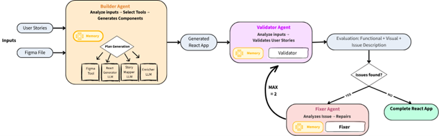
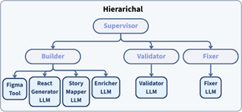
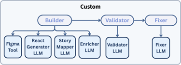
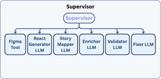

import ViewCounter from "@site/src/components/ViewCounter";

<h2>Can AI Build Front-End Apps from Designs and Requirements?  </h2>
<ViewCounter pageKey="Can AI Build Front-End Apps from Designs and Requirements? " />

**Front-end development is inherently collaborative and often messy.** Product managers define features through user stories; designers create interfaces in tools like Figma, and developers translate both into code. This translation step is where inconsistencies often appear: the final implementation may drift from the original requirements, the visual design, or both. 

**Our work asks a simple question:** Can AI generate front-end applications that are both functionally correct and visually aligned with design intent? 

### Our Approach: A Multi-Agent Pipeline 

Instead of relying on a single model, we designed a system that mirrors how real development works: generate, evaluate, and fix. The pipeline combines two complementary inputs: 

• User stories, which describe what the application should do 

• Figma designs, which describe what the application should look like 

 

Figure 1. Multi-agent pipeline for generating React applications from user stories and Figma designs. 

### How the Pipeline Works 

The system is organized around three specialized agents: 

**• Builder:** Generates the initial React application by combining information from user stories and Figma-derived representations. 

**• Validator:** Evaluates the generated output along two dimensions: functional correctness and visual fidelity. 

**• Fixer:** Repairs the issues detected during validation and improves the generated application. 

### Why Architectures Matter 

A key part of our study is not only whether the system works, but also how different multi-agent coordination strategies affect quality and efficiency. We compare three architectures: 

**• Supervisor (tool-calling):** A single controller decides which agent tool to invoke at each step. This keeps control centralized and adaptive. 

**• Hierarchical:** A top-level controller delegates work to specialized sub-controllers, helping localize reasoning and reduce context overload. 

**• Custom:** A deterministic workflow explicitly defines the execution order of the stages. This improves reproducibility and makes cost easier to track. 

One of the main findings of the paper is that architecture has only a modest impact on quality, but a much larger impact on efficiency. In particular, the Custom architecture reduces generator token usage substantially while preserving similar output quality. 

   

### What We Found 

We evaluated the framework on four real-world open-source projects containing 75 user stories paired with Figma frames. 

• On average, 54.1% of outputs achieved full functional coverage 

• 57.9% achieved full visual fidelity 

• When partial matches are included, these rates rise to 76.9% and 84.9%, respectively 

These results suggest that multimodal multi-agent systems can often produce applications that are close to correct, and that many remaining issues are localized and fixable rather than complete failures. 

### Why This Matters 

Most prior systems generate code from only text or only designs. In contrast, real front-end development depends on both. By combining requirements and design artifacts in a single pipeline, our framework moves closer to automating realistic end-to-end front-end workflows. 

### Takeaways 

• AI can generate usable front-end applications from requirements and design inputs 

• Full correctness remains challenging, especially in realistic multimodal settings 

• Most failures are incremental and can be improved through lightweight repair steps 

• The structure of a multi-agent system matters as much as the underlying model 
