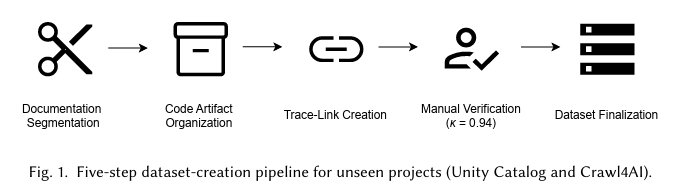

import ViewCounter from "@site/src/components/ViewCounter";

<h2>Can Large Language Models Connect Documentation to Code More Effectively?</h2>
<ViewCounter pageKey="Can Large Language Models Connect Documentation to Code More Effectively?" />

Documentation plays a vital role in software development by aiding communication among team members, providing guidance for software usage, and serving as a reference for maintenance and future development. It helps developers and users understand the system’s functionality, design decisions, and usage instructions. However, establishing and maintaining accurate traceability between documentation and code presents significant challenges. Documentation is often written in free-flowing, unstructured natural language and may contain ambiguous or implicit references, while source code consists of formal, structured elements. This difference makes it difficult to map documentation precisely to the relevant code, particularly when a single documentation segment relates to multiple code elements.

These challenges are further compounded as software evolves. Code refactoring, renaming, and architectural changes can lead to documentation decay, where the documentation persists but the underlying code links are broken. For new team members, navigating from developer-facing documentation, such as API references, tutorials, architectural descriptions, and function-level documentation, to the corresponding code implementations can be a non-trivial task, especially when the relevant code is scattered across multiple elements.

Various automated methods for documentation-to-code traceability have been developed to address these challenges. Traditional traceability methods, such as Information Retrieval (IR) techniques, rely on keyword matching and statistical analysis to identify trace links between documentation and code. However, these methods may not capture the deeper semantic relationships between documentation and code, may suffer from low precision or recall, and may require substantial manual effort to maintain traceability links as software systems evolve and codebases grow in size and complexity.

Recent advancements in Large Language Models (LLMs) offer promising opportunities to address these challenges. LLMs have demonstrated capabilities in understanding and generating human-like text, as well as processing and generating code. Their ability to comprehend natural language semantics and code syntax suggests the potential for improving documentation-to-code traceability by bridging the gap between unstructured documentation and structured code artifacts. To evaluate this potential, the authors evaluate three LLMs -Claude Sonnet, GPT-4o, and o3-mini—and compare their performance with established baselines, including TF-IDF, BM25, and CodeBERT.

 
The evaluation focuses on three research questions:

-  How accurately can LLMs identify trace links between documentation segments and their corresponding code elements? 

-   How effectively can LLMs explain the nature of relationships between documentation and code elements?

-   How completely can LLMs identify intermediate elements in documentation-to-code trace chains?

To answer these questions, the authors construct datasets from 29 open-source projects. The evaluation includes:

-    Two "unseen" projects, Unity Catalog and Crawl4AI, developed after the LLMs’ training cutoff date to minimize the chance of inclusion in the models’ training data.

-   A benchmark of 27 established projects comprising 25 Python libraries derived from CoDocBench and two Java microservice systems from the TransArc benchmark to evaluate generalizability across established codebases.

These projects include diverse developer-documentation styles, including API references, tutorial-style documentation, function-level docstrings, and sentence-level architectural descriptions, together with their corresponding code artifacts at different granularity levels. The unseen projects and TransArc cover API, tutorial-style, and architecture-facing documentation, while CoDocBench provides a benchmark for function-level developer documentation across many mature projects. This broader evaluation design allows the authors to evaluate documentation-to-code traceability across different documentation styles and software projects.

