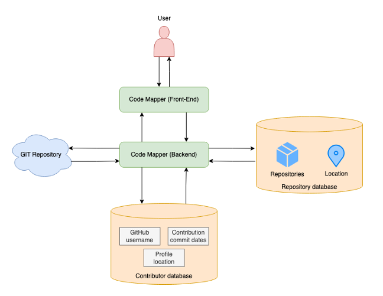

import ViewCounter from "@site/src/components/ViewCounter";

<h2>Code Mapper: Charting the Global Pulse of Open Source.</h2>
<ViewCounter pageKey="Code Mapper - Charting the Global Pulse of Open Source." />

Open source is more than just code, it’s a global movement fueled by collaboration across borders. Every repository, every commit, and every pull request represent the collective effort of developers worldwide. But despite this vast interconnected network, the **geographical reach** of open-source contributions often goes unnoticed. **Code Mapper** changes that.

By analyzing GitHub repositories, Code Mapper provides a powerful visualization of where contributors are located, transforming raw data into actionable insights. This isn’t just about mapping, it’s about understanding how open-source communities form, evolve, and where there’s potential for greater inclusivity. With millions of developers actively contributing to repositories, Code Mapper uncovers trends that shape the future of global software development. 

Unlike traditional methods that rely on incomplete heuristics like commit timestamps or email domains, Code Mapper extracts reliable, location-based insights to paint an accurate picture of global OSS participation. The tool highlights collaboration trends, reveals underrepresented regions, and helps maintainers see the **true impact** of their projects across the world. It allows organizations and researchers to identify **regional gaps** in contributions, assess the effectiveness of outreach initiatives, and make data-driven decisions to support and grow open-source communities in emerging tech hubs.

**The Architecture Behind Code Mapper** 

Code Mapper is built on a robust architecture that ensures the tool can efficiently process vast amounts of data while providing a seamless user experience. The **backend** is powered by **Python** and **Flask**, ensuring quick and scalable data processing. Python’s versatility in handling data analytics allows the system to process large sets of GitHub data quickly, while Flask, a lightweight web framework, builds the **RESTful API** that facilitates smooth communication between the backend and frontend. 

The backend is responsible for collecting **contributor data from GitHub** repositories. By accessing GitHub’s public APIs, Code Mapper gathers key information about contributors such as usernames, their contributions (commits, pull requests), and associated timestamps. Once this data is collected, it’s processed to determine the geographical locations of contributors. Through the use of geolocation algorithms and external APIs, Code Mapper accurately maps contributor locations, even when such information isn’t explicitly provided. This information is then served through a well-structured API, enabling easy access to the frontend. 

One of the key benefits of Code Mapper is its ability to **enhance project visibility** for maintainers and contributors alike. By understanding the geographic distribution of contributors, maintainers can make informed decisions about community engagement, outreach strategies, and regional support initiatives. For companies and academic institutions that rely on open-source software, these insights can lead to better investment in talent development and regional collaborations. 

Code Mapper also helps uncover disparities in participation, revealing underrepresented regions and highlighting areas where more support is needed. With a clearer view of global open-source contributions, developers, researchers, and organizations can take proactive steps to foster inclusivity, ensuring that talent and innovation are recognized and nurtured in every corner of the globe. 

Explore Code Mapper at [https://github.com/jaslatendresse/codemapper](https://github.com/jaslatendresse/codemapper) to experience how global open-source contributions take shape in real time. Watch the demo here:[https://www.youtube.com/watch?v=AtARvrBJbVM](https://www.youtube.com/watch?v=AtARvrBJbVM). 

As open-source software continues to drive technological innovation, tools like Code Mapper offer valuable insights into who is shaping the digital landscape. By fostering greater awareness of geographic participation, it enables developers, researchers, and project maintainers to build more **inclusive** and **collaborative** software ecosystems. With this level of transparency, the open-source community can take a more **proactive approach** to addressing disparities, ensuring that talent and innovation are recognized and supported across all regions. 

Open source is a global effort now, with **Code Mapper**, we can finally see just how far-reaching that effort truly is, and more importantly, how we can make it even strong 