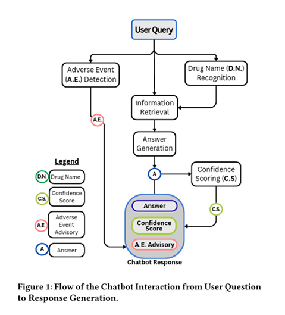

import ViewCounter from "@site/src/components/ViewCounter";

<h2>Engineering a Regulatory-Compliant AI Chatbot for the Pharmaceutical Industry </h2>
<ViewCounter pageKey="AI Chatbot for the Pharmaceutical" />

Large language models (LLMs) are rapidly transforming 
how organizations build conversational systems.
However, deploying LLM-based chatbots in highly regulated
domains requires more than strong language capabilities.
It demands **architectural safeguards, strict domain grounding,
and compliance-aware system design.**

In Experiences Developing an AI Chatbot in the Pharmaceutical Industry,
we describe the engineering of a **retrieval-augmented drug-information chatbot**
built for a global pharmaceutical company operating under regulatory frameworks
such as those enforced by **Health Canada.**
The project highlights the reality that in safety-critical
environments, correctness, traceability, and compliance take priority over fluency. 

## A Controlled Retrieval Architecture

 At the core of the system is a **retrieval-augmented generation (RAG) architecture** designed to enforce grounding and traceability. 

 

 When a user submits a query, the chatbot:
  1. Detects drug names and potential adverse events
  2. Retrieves relevant content from product monographs and internal FAQs 
  3. Optionally retrieves from a strict allowlist of trusted regulatory sources 
  4. Generates a response grounded only in the retrieved context 
  
The most important design principles are:

● **Grounding every response in approved product documentation** 
● **Restricting web access to trusted regulatory sources** 
● **Returning references and a computed confidence score with each answer** 

This controlled retrieval pipeline ensures that the LLM acts as a synthesizer of verified content not as an independent knowledge source. 

## Engineering for Structured Pharmaceutical Documents 

Product monographs are long, hierarchical documents combining narrative text and tables. Simple chunking degraded retrieval accuracy. To address this, sections and tables were summarized before embedding to improve semantic matching, while final responses remained grounded in the original text. This approach improved retrieval quality without sacrificing traceability, a critical requirement in regulated domains.

## Trust, Robustness, and Compliance 

Safety cannot rely on retrieval alone. The system integrates explicit safeguards:

**Confidence Scoring**  

Each response includes a computed confidence score derived from:

 ● Retrieval similarity  
 ● Source reliability  
 ● Question complexity  
 ● Model probability signals 

 
If the confidence score falls below a threshold, the chatbot displays a default message asking the user to rephrase the question, rather than generating a speculative answer. This mechanism reduces hallucination risk in high-stakes contexts.

## Robust Input Handling 

Real-world queries introduce variability:

 ● Misspelled drug names 
 ● Brand vs. generic name usage  
 ● Missing dosage information 
 
Normalization, spell correction, and a typeahead recommendation feature resolve drug name ambiguity before response generation. When a query involves a drug with multiple dosage forms or concentration levels, the chatbot issues an interactive clarification prompt so the user can select the correct variant, ensuring robustness under realistic usage conditions. 

## Pharmacovigilance Integration 

Regulatory compliance required embedding pharmacovigilance capabilities directly into the system. A specialized NER model detects mentions of adverse events in user queries. When identified, the chatbot triggers a safety workflow that provides reporting guidance and logs relevant information for review.

This integration demonstrates that in pharmaceutical contexts, conversational systems must actively participate in compliance processes not merely provide information.

Deploying LLM-based systems in regulated domains is not only a modeling challenge but a systems engineering task. Structured retrieval, strict source control, confidence estimation, document-aware preprocessing, and compliance-integrated workflows are essential for building safe and reliable AI systems in pharmaceutical settings. 