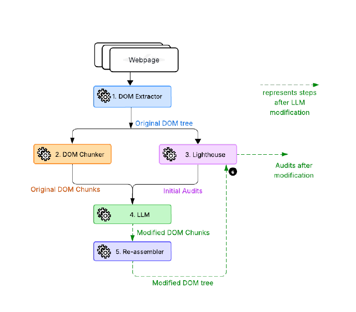

import ViewCounter from "@site/src/components/ViewCounter";

<h2>Evaluating the Use of LLMs for Automated DOM-Level Resolution of Web Performance Issues</h2>
<ViewCounter pageKey="Evaluating the Use of LLMs for Automated DOM-Level Resolution of Web Performance Issues" />

Web performance is an important aspect of user experience, engagement, and conversion rates. One important client-side factor is the Document Object Model (DOM), which influences how browsers render and interact with webpages. Optimizing the DOM is challenging because modifications must balance functionality and performance.

Recent advances in Large Language Models (LLMs) have shown promise in software engineering tasks such as code generation, automated testing, web security, and accessibility improvements. This work evaluates whether LLMs can automatically resolve web performance issues through DOM-level modifications.

The evaluation included **nine LLMs**: Claude 3.7 Sonnet, Claude 3.7 Sonnet (Reasoning), DeepSeek R1, DeepSeek V3, Llama3.3 70B, GPT-4.1, GPT-4o-mini, o4-mini, and Qwen2.5 32B-Instruct. The models were evaluated on DOM trees extracted from **15 popular webpages.** Lighthouse audit reports were generated, and the models were instructed to modify the DOM to resolve the identified issues. The modified webpages were then evaluated again using Lighthouse.

All evaluated LLMs achieved a **100% reduction in SEO and Accessibility issues.** These audits depend primarily on semantic understanding, showing that LLMs can effectively identify and resolve semantic webpage issues.

Results for performance-critical issues were mixed. 
**Qwen2.5 32B-Instruct and GPT-4.1** achieved substantial improvements across Initial Load Performance, Interactivity Performance, Runtime Performance, Network Optimization, and Resource Optimization. In contrast, **GPT-4o-mini** consistently introduced regressions, increasing issues related to Initial Load Performance, Interactivity Performance, Runtime Performance, and Visual Stability.

**Visual Stability** was one of the most challenging categories. Most models introduced some level of visual instability, suggesting that understanding spatial relationships within webpages remains difficult for current LLMs.
The analysis of DOM modifications showed that most models followed a **predominantly additive strategy,** adding more elements than they removed. GPT-4o-mini differed by removing more elements and introducing a high number of positional changes. The analysis also showed that many modifications occurred at relatively shallow DOM depths and that textual modifications were associated with performance improvements.

The findings show that LLMs are highly effective at resolving semantic issues such as **SEO and Accessibility.** However, their effectiveness for performance-critical optimizations is mixed, and **Visual Stability remains a significant challenge.** These results highlight the need for **validation and oversight** when using LLMs for automated DOM-level web performance optimization.