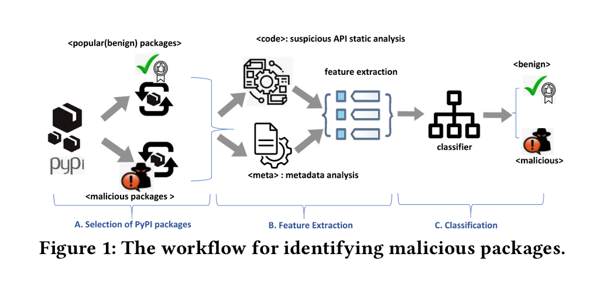

import ViewCounter from "@site/src/components/ViewCounter";

<h2>Identifying Malicious Packages through Maintainer and Project Signals</h2>

<ViewCounter pageKey="malicious-package" />

Malicious software packages are increasingly targeting open-source ecosystems like PyPI (the Python Package Index), often introduced through subtle tactics such as typosquatting, misleading metadata, or suspicious maintainer activity. These packages can cause serious harm before they are detected. To help address this challenge, we developed a machine learning-based method that automatically identifies malicious PyPI packages by analyzing their metadata, code, configuration files, and other package-level signals.

We started by identifying features that are indicative of malicious intent. These included metadata attributes such as whether the maintainer provided a valid email or homepage, file-related characteristics like incomplete setup configuration or mismatched license types, and code-level signals such as obfuscated content, suspicious URLs, or use of risky APIs (getattr, connect, read, open). Our goal was to capture behavioral and contextual patterns that might be overlooked by traditional rule-based or static analysis tools.

To build a reliable dataset, we collected **5,193 benign** and **138 malicious** PyPI packages. The benign packages were selected based on usage and popularity from sources like PyPI and Libraries.io. The malicious packages were curated from past threat intelligence reports and research datasets, and spanned diverse attack types such as typosquatting, trojans, and backdoors. A separate test set of **397 benign** and **143 new malicious** packages was used to evaluate generalizability.

We experimented with six supervised machine learning models: random forest, decision tree, support vector machine, multilayer perceptron, naive Bayes, and a **stacking ensemble** combining them. Our goal was not just accuracy, but also interpretability and practical utility. The stacking classifier consistently outperformed others.

The **stacking classifier achieved an F1 score of 94.2%**, with **precision at 98%** and **recall at 91%** on the training dataset. On the unseen test set, the model achieved an F1 score of **90%**, confirming its generalizability. Notably, **textual features** (extracted from source code using tools like Packj) contributed significantly to performance, particularly when identifying suspicious API usage.

We also analyzed feature importance and found that metadata-based indicators such as invalid homepage, invalid author email, and license mismatch were among the most predictive features, often more so than code-level indicators. This suggests that attacker behavior is often visible in how a PyPI package is configured and published, not just in what its code does.

When evaluated on a separate test set of previously unseen PyPI packages, the model maintained similarly strong performance. This shows it generalizes well and can serve as an early-warning system for malicious package detection. Since our approach does not rely on deep static or dynamic analysis, it remains lightweight and suitable for real-time integration into package registries or continuous integration pipelines.

By combining machine learning with targeted feature design, we offer a practical and proactive method for identifying threats in the Python software supply chain. Our results show that **metadata-driven models combined with text features** can effectively surface early signals of malicious intent helping protect developers and users from compromised PyPI packages before they reach widespread adoption.

