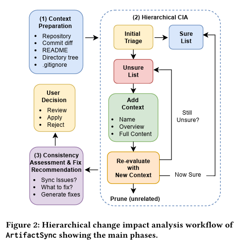

import ViewCounter from "@site/src/components/ViewCounter";

<h2>Keeping Software Artifacts Synchronized with ArtifactSync</h2>
<ViewCounter pageKey="Keeping Software Artifacts Synchronized with ArtifactSync" />

### When Code Changes but Everything Else Doesn’t

Modern software repositories contain more than source code. Documentation, unit tests, configuration files, and build scripts are also essential parts of a project. These artifacts help developers understand and maintain the system. When the source code changes, related artifacts often need updates as well.
If these updates are not performed together, inconsistencies appear across the repository. Documentation can become outdated, tests may fail or become irrelevant, and builds may break. Over time, this lack of synchronization increases maintenance effort and makes software systems harder to manage

### Why Current Tools Struggle
Several approaches are used to maintain consistency across artifacts, including manual checks, static analysis tools, and Continuous Integration pipelines. These approaches help detect certain issues but still leave gaps.
•	Manual checks place a heavy cognitive burden on developers.
•	Static analysis tools mainly capture syntactic relationships.
•	CI pipelines detect failing tests but cannot identify missing updates.
As a result, keeping artifacts synchronized across a repository remains challenging.

### ArtifactSync

ArtifactSync addresses this challenge by automatically detecting inconsistencies across software artifacts. The tool analyzes recent commits to understand how the code has changed and identifies artifacts that may be affected by those changes.
For each detected issue, ArtifactSync provides a clear explanation and suggests a concrete fix that can be applied directly. The tool is available both as a command-line application and as a Visual Studio Code extension, allowing it to integrate into a developer’s workflow.

### How It Works

The core idea behind ArtifactSync is to avoid analyzing every file in the repository in full detail. Doing so would be too expensive and would exceed what an LLM can process at once. Instead, the tool starts broad and only zooms in where it needs to.

When a developer points ArtifactSync at a commit, the tool first gathers some lightweight context: the repository's file tree, the README, and the commit diff. This gives it enough to understand the project structure and what changed without having to load every file.

From there, the tool does an initial pass over the repository and sorts each artifact into one of three categories:

1.	Sure (Yes) — the file is clearly related to the change, so it is accepted as impacted right away.
2.	Not related (No) — the file has no apparent connection to the commit, so it is discarded.
3.	Unsure (Maybe) — the relationship is plausible but not certain, so the file needs further examination.

What happens next with those unsure items is where the approach gets interesting. Rather than loading their full contents right away, the tool starts with just the file name, then requests a structural overview like function signatures or class definitions and re-evaluates.

If that is enough to make a call, the file either gets confirmed as impacted or discarded. If not, the tool goes one step further and requests the full file content before trying again. This loop continues until every uncertain item has been resolved.

Once the tool knows which artifacts are affected, it shifts to figuring out whether the impact actually causes a problem. A file can be related to a change without needing an update. For example, a test might reference changed code but still work correctly.

For cases where there is a real inconsistency, ArtifactSync generates a concrete fix along with a clear explanation that the developer can review and apply. This "zoom in only when needed" approach is what makes it possible to run the analysis across large repositories without it becoming impractical.

### Evaluation

The approach was evaluated using 20 commits across two open-source repositories: Crawl4AI and Unity Catalog. Each commit introduced changes designed to break synchronization between artifacts, such as modifying code without updating documentation.
ArtifactSync correctly identified impacted artifacts in all scenarios for Crawl4AI and in all cases for Unity Catalog. In two Unity Catalog scenarios, recommendations and fixes were partially incorrect due to incorrect file paths returned by the LLM.

### Supporting Cross-Artifact Maintenance

Maintaining consistency across code, documentation, and tests remains a persistent challenge in software development. ArtifactSync demonstrates how hierarchical change impact analysis combined with Large Language Models can support automated synchronization of repository artifacts.