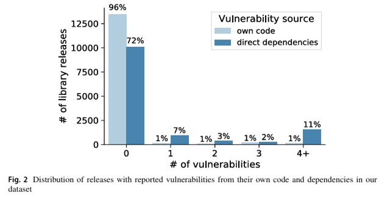

import ViewCounter from "@site/src/components/ViewCounter";

<h2>NPM and the Trade-Offs of Reuse</h2>

<ViewCounter pageKey="NPM-and-trade-Offs-Resuse" />

The NPM ecosystem has become central to modern software development, offering a vast repository of packages that developers can **reuse rather than build from scratch.** This reuse brings **strong productivity gains** but also exposes entire systems to significant risk, because when many developers rely on a small number of upstream libraries, a vulnerability in one library can propagate widely. The concept of technical leverage helps capture this trade-off: it measures how much of a project’s code (or functionality) is **"borrowed" from external dependencies** (i.e., third-party libraries) compared to code written by the project’s maintainers.

**Understanding Technical Leverage in NPM**

In the JavaScript community, libraries often rely not just on direct dependencies but also on **dependencies of dependencies.** By examining thousands of library releases, it becomes clear how much code is reused from external sources versus written internally.

**Key Findings**

The results are striking:

Small- to medium-sized libraries, on average, reuse **about 2.5 times more external code** than their own. In other words, reuse dominates their codebase.
Large libraries tend to have much lower leverage: in many cases, only about **3% of their code comes from external dependencies,** indicating they rely more on their own codebase.
High leverage appears to pay off in development efficiency: for small/medium libraries, leverage correlates with shorter release cycles, suggesting that **reuse helps accelerate development and maintenance.**
But the reuse comes with stark security costs: libraries with high technical leverage have 4–7× greater risk of exposure to vulnerabilities compared to less leveraged libraries.
Even when considering dependencies of dependencies, the pattern remains: the opportunity **(ease and speed of development)** and risk (vulnerability exposure) are magnified in NPM.

**Implications for Developers.**

These findings underscore a **fundamental trade-off in open-source software:** leveraging external code massively reduces workload and speeds up releases but it also expands the attack surface. A vulnerability or malicious insertion in any dependency (or dependency-of-dependency) can threaten a large portion of the ecosystem.

From a practical standpoint, developers and organizations should **treat dependency management as a security-critical decision.** Choosing widely used packages with many dependencies can increase efficiency, but it also requires vigilant monitoring for vulnerabilities, timely updates, and careful auditing, especially for **high-leverage dependencies.**

As ecosystems grow and dependencies multiply, the fragility inherent in heavy reuse becomes more pronounced. Technical leverage while offering real development benefits carries a possibly hidden cost: a heightened security risk. Developers, maintainers, and organizations need to **balance the benefits of reuse with awareness of the risks,** making dependency choices part of a **larger security strategy.**