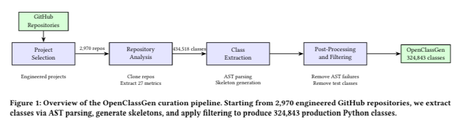

## OpenClassGen: Bringing Real-World Class-Level Code Generation to LLM Research

### Moving Beyond Function-Level Benchmarks
Large language models (LLMs) have advanced code generation research and led to the development of multiple evaluation benchmarks. Most existing benchmarks focus on function-level code generation, where models generate isolated and self-contained functions. Repository-level benchmarks require models to work with complete software projects and resolve dependencies across files.
Class-level code generation lies between function-level and repository-level code generation and has received less attention than these two settings.
Class skeletons provide structural information through class signatures, method signatures, and docstrings without requiring full repository context. Existing datasets for class-level code generation remain limited in scale. ClassEval contains 100 synthetic Python classes, while RealClassEval contains 400 real-world Python classes.

### Introducing OpenClassGen
OpenClassGen is a dataset containing 324,843 Python classes extracted from 2,970 engineered open-source projects. Each entry contains a human-written class implementation paired with a corresponding class skeleton that includes class signatures, method signatures, and docstrings. The dataset also includes 27 static code metrics covering size, complexity, coupling, cohesion, and inheritance.

OpenClassGen provides class skeletons that are self-contained and do not require full repository context. The dataset supports tasks such as fine-tuning, retrieval-augmented generation, difficulty prediction, and failure analysis.
OpenClassGen is publicly available through Hugging Face, allowing researchers and practitioners to easily explore, download, and integrate the dataset into their workflows. The dataset can be accessed through [OpenClassGen on Hugging Face](https://huggingface.co/datasets/mrahman2025/OpenClassGen). The dataset card provides information about the dataset structure, available fields, and examples for loading the dataset using the Hugging Face Datasets library.

### Building a Large-Scale Real-World Dataset
The dataset was built by selecting engineered open-source repositories using filtering criteria related to licensing, repository activity, pull requests, issues, lines of code, and code-to-comment ratios. Repositories without licenses, repositories with fewer than two contributors, and archived repositories were excluded.
After selection, repositories were cloned and analyzed. Using Python’s ast module, class skeletons were extracted by preserving class signatures, method signatures, and docstrings, while replacing method bodies with pass statements. The process also computed 27 static code metrics covering size, complexity, coupling, cohesion, and inheritance.
The dataset was then filtered. Classes that failed AST parsing were removed, along with test classes identified using naming and file-path heuristics. The final dataset contains 324,843 Python classes.
 

### Capturing Real-World Documentation and Structure
OpenClassGen contains documentation variability found in real-world software projects. Approximately 20% of classes are fully documented, 44% are partially documented, and 36% contain no docstrings.
The dataset also contains structural variation. Approximately 28% of classes contain zero methods, 44% contain between one and three methods, and 28% contain four or more methods.
OpenClassGen includes projects from multiple domains, including cloud and infrastructure tooling, scientific computing, data processing, machine learning, DevOps, networking libraries, and web frameworks.
Evaluating LLMs on Class-Level Generation
GPT-o4-mini, Claude-4-Sonnet, and Qwen-3-Coder were evaluated on a subset of 300 classes. The subset was balanced across fully documented, partially documented, and undocumented classes.
The evaluation considered syntactic quality, semantic quality, structural quality, and functional correctness. The results report an average CodeBERTScore-F3 of 0.89 and an average TSED score of 0.83. The average pass rate for functional correctness was 0.33.

### Supporting Future Research
OpenClassGen is a large-scale dataset of real-world Python classes with documentation variability, structural variation, and domain diversity.
The dataset supports future research directions including fine-tuning for class-level code generation, retrieval-augmented generation, difficulty prediction, failure analysis, and dataset subset construction based on structural properties.
OpenClassGen supports research in class-level code generation.
