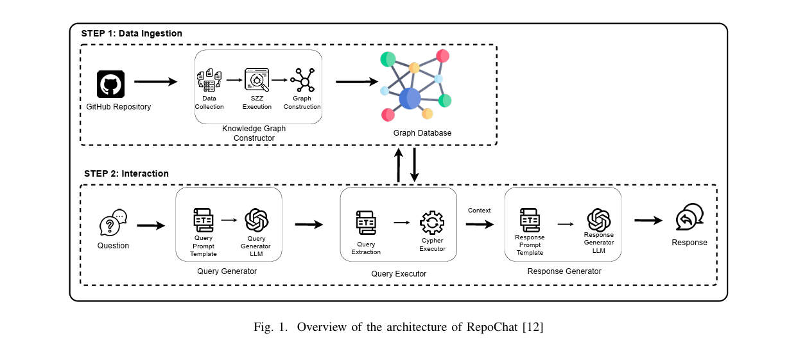
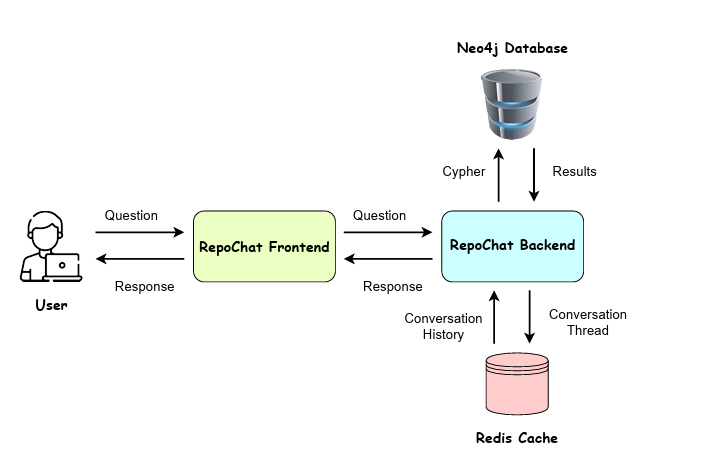

<h2>RepoChat: Enhancing GitHub Repository Interactions with LLM-Powered Chatbot</h2>

In the dynamic landscape of software development, repositories like GitHub hold invaluable data, including source code, documentation, issue tracking, and commit histories. However, accessing and interpreting this information can be time-consuming and require considerable technical expertise. This complexity poses challenges, especially for non-technical stakeholders, such as project managers, who need insights without delving into technical details. 

RepoChat is a web-based tool designed to streamline repository-related queries by integrating Large Language Models (LLMs) with knowledge graphs. It simplifies data retrieval from repositories, making it accessible and comprehensible to all users. 

RepoChat operates in two main phases: Data Ingestion and Interaction. 

**Data Ingestion.**
The Data Ingestion phase involves constructing a knowledge graph from repository metadata, including commits, issues, files, and user information. The process begins by cloning the specified repository and extracting commit data using Git commands. It further employs the GitHub GraphQL API to gather additional repository metadata. To identify bug-fixing and bug-introducing commits, RepoChat utilizes the R-SZZ variant of the SZZ algorithm, mapping these elements into a knowledge graph stored in a Neo4j database. 

**Interaction.** 
During the Interaction phase, users input natural language questions. RepoChat translates these questions into graph queries using an LLM, executes them against the knowledge graph, and generates user-friendly responses. This phase includes a Query Generator that converts natural language questions into graph queries, a Query Executor that processes and executes these queries, and a Response Generator that interprets the results and formulates coherent responses. 

RepoChat's performance was evaluated through a user study involving participants with varying levels of experience in working with GitHub repositories. The tool demonstrated high accuracy in answering repository-related questions, showcasing its effectiveness in retrieving and presenting relevant information. 

## Architecture of RepoChat 

The architecture of RepoChat consists of two primary components: the backend and the frontend. 

### Backend 
The backend manages data ingestion and processes user queries. It includes two key endpoints: 

**Ingest Endpoint:** This endpoint collects repository data by cloning the specified GitHub repository, extracting commit information using Git commands, and gathering detailed metadata (such as issues and pull requests) via the GitHub GraphQL API. The collected data is then structured into a knowledge graph, capturing relationships between commits, issues, files, and users. This knowledge graph is stored in a Neo4j database for efficient querying. 
Chat Endpoint: This endpoint processes natural-language questions submitted by users. It utilizes the Langchain framework to generate Cypher queries (the query language for Neo4j) from user inputs. The generated queries are executed against the knowledge graph, and the retrieved results are formatted into clear, natural-language responses for the user. 
The backend employs the Langchain framework to facilitate the development of applications powered by large language models (LLMs). Langchain simplifies the process of building applications that interact with LLMs by offering modular components for prompt management, query generation, and response formatting. It ensures accurate query generation, enhancing the system's reliability and efficiency. 

The Neo4j database stores and manages the knowledge graph, providing a robust and efficient system for handling complex data relationships. 

### Frontend 
The frontend offers intuitive interfaces for both data ingestion and user interaction. The data ingestion interface collects repository details and authentication credentials, while the chat interface provides a seamless conversational environment for querying the repository. Users can input natural language queries, and RepoChat translates them into graph queries, retrieves the relevant data, and delivers clear, easy-to-understand responses. 

RepoChat is deployed as a web application, accessible via standard web browsers at https://repochattool.streamlit.app/. Its source code is publicly available on Zenodo (https://zenodo.org/records/14673950) for those interested in exploring or contributing to its development. 

For more details and to try RepoChat, visit https://repochattool.streamlit.app/. 