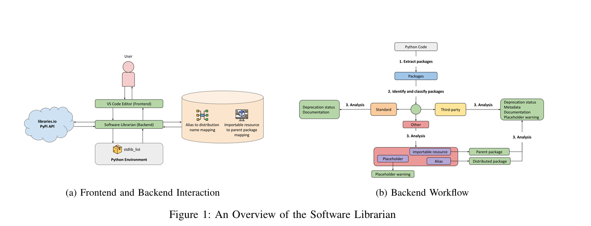

<h2>Smart Package Management with Software Librarian </h2>

In modern software development, open-source packages are essential building blocks that help developers innovate faster. However, managing these dependencies effectively is challenging. Issues such as outdated or deprecated libraries, licensing conflicts, and security vulnerabilities can compromise software quality. With the rise of AI-powered coding assistants like GitHub Copilot, ensuring that recommended packages are safe and reliable is more crucial than ever. 

While AI-powered tools like GitHub Copilot enhance developer productivity by suggesting code snippets, they don’t evaluate the reliability of the packages they recommend. This can lead to potential risks, such as: 

 - Using deprecated or unsupported packages that may break over time. 
 - Integrating legally restricted libraries that pose compliance risks. 
 - Relying on insecure dependencies that could introduce vulnerabilities into a project. 

**Meet Software Librarian: Your AI-Powered Package Guardian**  

To bridge this gap, **Software Librarian** was developed as a Visual Studio Code extension. This tool enhances GitHub Copilot’s package recommendations by analyzing suggested dependencies in real-time and providing key insights to developers. 

**How Software Librarian Works** 

Once installed in VS Code, Software Librarian automatically monitors package recommendations and evaluates them based on key criteria: 

 1. **Package Classification:** It identifies whether a package is standard, third-party, or invalid with 99% accuracy, ensuring developers     know what they are importing.  
 2. **License and Deprecation Checks:** It alerts developers about potential legal restrictions and warns them if a package is deprecated.  
 3. **Health Metrics:** It assesses package reliability by analyzing factors such as maintenance activity, security vulnerabilities, and community adoption.

**Avoiding Deprecated Packages** 

Imagine a developer writing Python code using GitHub Copilot. The assistant suggests importing the “distutils” package. Software Librarian instantly flags this package as deprecated and suggests using “setuptools” instead. This proactive approach prevents developers from using outdated dependencies that could lead to maintenance issues. 

Software Librarian seamlessly integrates into the developer workflow without disrupting the coding process. It is available for free on the **Visual Studio Marketplace**, and its **open-source** nature allows the community to contribute and enhance its capabilities. 

Get started today: [Download Software Librarian](https://marketplace.visualstudio.com/items?itemName=jaslatendresse.software-librarian)

As AI-powered coding assistance evolves, responsible package management will become even more critical. Tools like Software Librarian empower developers to write secure, compliant, and maintainable code while still benefiting from AI-driven suggestions. 

To see Software Librarian in action, check out the official **demonstration video**: [Software Librarian](https://www.youtube.com/watch?v=hnPr0rvL8lk)  

By combining AI assistance with intelligent package management, developers can ensure that innovation remains **secure, efficient, and future proof.**