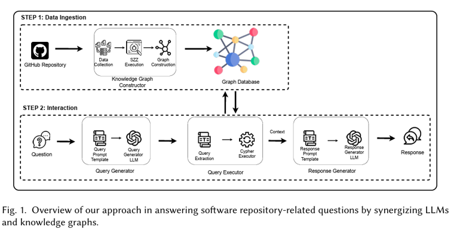

import ViewCounter from "@site/src/components/ViewCounter";

<h2>Synergizing LLMs and Knowledge Graphs for Software Repository-Related Question Answering</h2>
<ViewCounter pageKey="Synergizing LLMs and Knowledge Graphs for Software Repository-Related Question Answering" />

Software repositories contain valuable information for understanding the software development
process. They record commits, issues, files, and developer activities that can provide insights
into project evolution, developer contributions, and bug-fixing activities.

However, extracting meaningful insights from repository data is time-consuming and often
requires technical expertise. Answering a question such as “Which developer fixed the most
bugs in a particular file?” may require collecting data, connecting multiple repository entities,
and writing specialized queries.

Software engineering chatbots aim to simplify this process by allowing users to interact with
repositories through natural language. Earlier chatbots mapped user questions to predefined
intents and actions. However, they cannot answer questions whose intents have not been
defined in advance. LLMs provide more flexible natural language interaction, but existing
retrieval-based approaches may retrieve irrelevant data or fail to retrieve the repository data
required to answer a question.
In our paper, **“Synergizing LLMs and Knowledge Graphs: A Novel Approach to Software
Repository-Related Question Answering,”** we investigate whether combining LLMs with
knowledge graphs can improve the accuracy of repository-related question answering.

Knowledge graphs are structured representations that model entities and their relationships.
Our repository knowledge graph contains four entities:
- Users
- Commits
- Issues
- Files

It also represents relationships such as users authoring commits, users participating in issues,
commits changing files, commits fixing or introducing issues, and issues impacting files.
These relationships allow the approach to answer questions that require information from
multiple repository entities. For example, determining the developers who fixed the most bugs in
a file requires connecting users to the commits they authored, the issues fixed by those
commits, and the files impacted by those issues.

The approach consists of two main steps: data ingestion and interaction.
During data ingestion, the **Knowledge Graph Constructor** collects repository data through the
GitHub GraphQL API and models it as a knowledge graph. It also uses a variation of the SZZ
algorithm to identify bug-fixing and bug-introducing commits. The resulting knowledge graph is
stored in a Neo4j database.
The interaction step consists of three components:
1. The **Query Generator** uses an LLM to translate a natural language question into a
Cypher query based on the knowledge graph schema.
2. The **Query Executor** extracts and executes the Cypher query against the knowledge
graph.
3. The **Response Generator** uses the retrieved data to generate a natural language
answer.
The best configuration used GPT-4o with few-shot chain-of-thought prompting. The prompt
included examples showing how to determine the intention of a question, identify the relevant
entities and relationships, construct the reasoning path, and generate the Cypher query.

We evaluated the approach on AutoGPT, Bootstrap, Oh My Zsh, React, and Vue. We curated
150 repository-related questions representing 10 intents, including commits by date, file
commits, buggy files, bug-fixing commits, and developer activities.

The questions were classified into three difficulty levels based on the number of knowledge
graph relationships required to answer them. Level 1 questions require a single entity, Level 2
questions require one relationship, and Level 3 questions require two or more relationships.
The complete evaluation included 150 questions for each of the five projects, resulting in 750
project-question combinations. Each question was executed five times, and a question was
considered correctly answered when the approach returned the correct response in at least
three executions.

Our approach achieved an overall accuracy of 82%. Its accuracy ranged from 78% for Vue to
85% for Oh My Zsh.
Based on question difficulty, the approach achieved:
- **87%** accuracy for Level 1 questions
- **77%** accuracy for Level 2 questions
- **87%** accuracy for Level 3 questions

The approach achieved 82% overall accuracy, compared with 70% for MSRBot and 19% for
GPT-4o-search-preview. It outperformed MSRBot on Level 1 and Level 3 questions, while
MSRBot performed slightly better on Level 2 questions.
The approach also produced consistent responses. It answered 76.4% of the questions
correctly in all five executions and 81.7% correctly under the majority-vote criterion.

We conducted a task-based user study with 20 participants to assess the usefulness of the
approach. Each participant completed five repository-related tasks using their usual methods
and then completed the tasks using our chatbot. For the manual tasks, participants could use
Git commands, repository browsing, scripts, web searches, or AI assistants.
Participants completed 69 of 100 tasks using their usual methods and 91 using the chatbot.
They provided correct answers for 36 tasks using their usual methods and 84 using the chatbot.
Only three participants completed all five tasks manually, compared with 15 using the chatbot.
The chatbot also reduced task completion time. Participants spent a median of 20.7 minutes
completing the five tasks manually and 10.3 minutes using the chatbot. Participants reported
that the chatbot made the tasks easier, saved time, and was preferable to their usual methods.

Our findings demonstrate that synergizing LLMs with knowledge graphs and few-shot chain-of-
thought prompting is a viable approach for repository-related question answering. The

knowledge graph provides structured repository data, while the LLM allows users to ask
questions in natural language.
The user study further shows that the approach can make repository data more accessible.
Participants completed more tasks correctly and in less time with the chatbot than with their
usual methods.