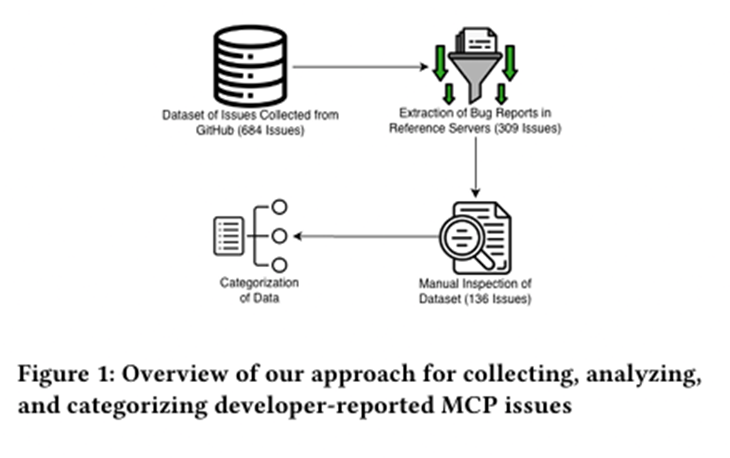

import ViewCounter from "@site/src/components/ViewCounter";

<h2>Understanding Developer Challenges in the Adoption of the Model Context Protocol </h2>
<ViewCounter pageKey="Understanding Developer Challenges in the Adoption of the Model Context Protocol" />

## The Rise of AI Agents

Recent developments in artificial intelligence have enabled the development of AI agents that can interact with external tools and services. These agents extend the capabilities of language models by allowing them to access external resources and perform tasks that require interaction with systems outside the model environment.

## Integration Challenges in AI Systems
Despite the increasing adoption of AI agents, integrating them with external systems remains difficult. AI applications often rely on multiple frameworks, tools, and data sources, each of which may use different communication methods and interfaces. Because these interfaces are not standardized, developers must often implement custom integrations when connecting AI models with external services. This lack of consistency increases development complexity and can slow down the process of building reliable AI applications.
## The Role of the Model Context Protocol (MCP)
To address these integration challenges, the Model Context Protocol (MCP) was introduced as a standardized interface that enables AI applications to interact with external systems. MCP allows language models to access different resources such as files, databases, and external services through a unified protocol. By providing a consistent interface for communication, MCP simplifies how AI agents retrieve information and interact with tools outside the language model.
## Adoption of MCP in the AI Ecosystem
Following its introduction in late 2024, MCP began gaining attention within the AI development community. To support developers in adopting the protocol, several reference servers were introduced to demonstrate how MCP can be implemented in practice. These servers provide examples showing how AI systems can interact with tools and services through MCP. Developers can use these reference implementations as guidance when building their own MCP-based applications.
However, despite the availability of reference implementations, developers continue to encounter challenges when integrating MCP with real-world systems and external tools.
## Investigating Developer Challenges
To better understand these difficulties, the study analyzes developer-reported issues from MCP reference server repositories. These issues include bug reports and pull requests submitted by developers who encountered problems while implementing or using MCP in their systems.
The analysis focuses on identifying categories of integration problems developers experience, including:

  •   ** File system operations,** such as problems accessing, reading, or writing files.

  •   ** Data validation and type mismatches,** where exchanged data does not match the expected structure or format.

  •   ** Communication and connection issues,** which occur when AI systems attempt to interact with external tools or services.
     
By examining these reports, it becomes possible to identify the types of problems developers face and understand where integration becomes difficult.

## File System Issues During MCP Integration
One of the most frequently reported challenges involves file system operations. When AI systems interact with files or local storage through MCP, developers may encounter difficulties related to reading, writing, or accessing files. These problems may arise when the system attempts to retrieve data from files or when the file structure does not match the expected configuration.
The analysis shows that file system-related operations represent the largest category of reported issues among developers working with MCP.
## Data Validation and Type Mismatches
Another category of challenges involves data validation and type mismatches. These issues occur when the data exchanged between components does not match the format expected by the receiving system. For example, a tool may expect a specific data type or structure, but the data received from another component may not match those requirements.
Such mismatches can lead to errors during execution and require developers to investigate and adjust how data is exchanged between systems.
## Communication and Connection Problems
Developers also encounter challenges related to communication between system components. These issues arise when AI agents attempt to establish or maintain connections with external services or tools. Problems in this category may include connection failures, communication interruptions, or difficulties coordinating interactions between different services.
Resolving these issues can require additional debugging and configuration, increasing the effort needed to successfully integrate MCP-based systems.
## Insights for the MCP Development Community
Analyzing developer-reported issues provides valuable insight into the practical challenges involved in adopting MCP. By identifying common problem categories, maintainers of MCP repositories can better understand where developers encounter difficulties and where improvements may be needed.
These findings contribute to a clearer picture of the obstacles developers face when integrating MCP into AI agent systems.