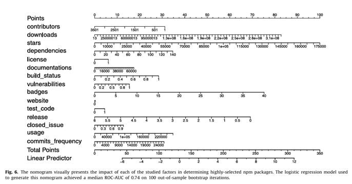

import ViewCounter from "@site/src/components/ViewCounter";

<h2>What Makes an npm Package Highly Selected? Insights from a Large-Scale Study</h2>
<ViewCounter pageKey="What Makes an npm Package Highly Selected? Insights from a Large-Scale Study" />

There are massive numbers of packages available in the npm ecosystem, and many of them provide similar functionalities. So, when developers need a package, how do they decide which one to use? What makes some npm packages stand out and experience high interest from developers while others do not?

These are important questions because finding the right package to use can be challenging, especially when many packages provide similar functionalities. Understanding what makes a package highly selected can help developers decide which packages to select among many existing options. It can also help improve package recommendation systems and the user experience of package search engines. For package developers, understanding these characteristics can help them improve their packages to meet the requirements and experiences that users look for, acquire the community’s attention, and increase package usage and overall reputation.

So, what do developers actually look for when selecting an npm package?

We surveyed 118 JavaScript developers and asked them about 17 factors that can affect their decision when selecting an npm package. The responses gave us a good indication of what developers consider important when looking for a package.

The answer was fairly clear. Developers look for packages that are **well-documented, receive a high number of stars on GitHub, have a large number of downloads, and do not suffer from security vulnerabilities.**

Documentation was the most important factor. In fact, 93% of the responses agreed that the GitHub repository of an npm package should have some form of documentation. The number of downloads was the second most important factor, with more than 85% of responses indicating that developers consider download counts when searching for a package to use.

GitHub stars were also considered important. Developers look at the number of stars as an indication of the package's reputation and popularity. Security vulnerabilities were another important consideration, with 62% of developers viewing vulnerabilities as an essential factor when finding and selecting relevant npm packages.

But what about everything else?

Developers also considered factors such as release frequency, commit frequency, test code, license, usage, dependencies, closed issues, and contributors, although the responses were less consistent for these factors. And some factors were generally not considered important at all. Forks, badges, watchers, websites, and build status were among the factors that developers tended not to consider when selecting an npm package.

For more details about the quantitative analysis and the characteristics associated with highly-selected npm packages, see the paper [What are the characteristics of highly-selected packages?A Case Study on the npm ecosystem](https://das.encs.concordia.ca/pdf/Mujahid_JSS2023.pdf).

**Key takeaway**

So, what makes an npm package highly selected?

From the developers' perspective, highly-selected packages are expected to be **well-documented, have a high number of GitHub stars, have a large number of downloads, and not suffer from security vulnerabilities.** The quantitative analysis complemented the developers' perceptions, particularly regarding downloads, stars, documentation, and vulnerabilities, while also revealing differences between developers' perceptions and the characteristics observed in highly-selected packages. In particular, **closed issues and badges showed greater importance in the quantitative analysis than developers reported in the survey.**

The results provide a closer look at the characteristics associated with highly-selected npm packages and show that what developers say they look for does not always completely match what can be observed in highly-selected packages.