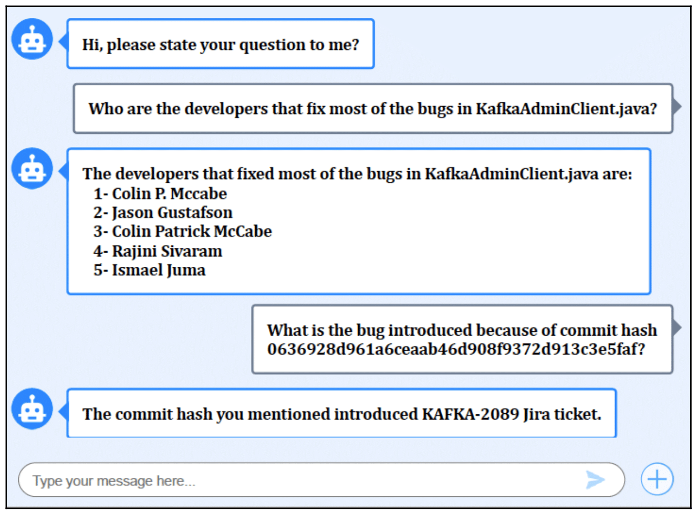

<h2>Chatting with your software project!</h2>

No matter where you stand in the software development food-chain, analyzing your software repository to get insights into your own project is part of the day-to-day business. Developers use the repository to identify (and blame!) the colleague that introduced that nasty piece of code, managers use the repository to get productivity metrics on their teams and everyone ends up checking Stack Overflow on how to find the right git command to do just that.

Analyzing software repository data can be tricky. A Microsoft study showed that developers struggle to answer most of the common questions using repository data. In most cases, this happens for two main reasons:

1. **Git commands:** one needs to have a real grasp on the git commands to extract the right information from their repositories. Queries like “How many commits happened last week” might be simple to answer as a developer, but can be tricky for management professionals, that are not necessarily well-versed with git commands.
1. **Data integration:** even developers that speak the “git language” might run into trouble when trying to integrate data from different sources (e.g., bug tracker, code review system, etc.). Questions like “what is the most buggy file in the repo?” require the integration of a code repo (e.g., Git) with a bug tracker (e.g., Jira), which is a non-trivial and time-consuming task.

### What should we do now? Chatbots to the rescue!

Software chatbot is considered as an old-new topic. The first chatbot has been introduced in the 1960s by Joseph Weizenbaum called Eliza. In recent years, chatbots become more integrated into our lifestyle as an “Assistant” to perform various things such as booking a flight ticket. Moreover, many companies use chatbots to serve their customers by answering frequent questions. The rise of chatbots inspired us to develop a chatbot to assist software practitioners in their daily tasks using natural language. Therefore, we devised an approach called MSRBot that leverages stored data from various software repositories (e.g., Git and Jira) to answer some of the most common questions by developers. MSRBot allows its users to ask questions about their projects using natural language and get the answers through the MSRBot user interface as shown in the figure below:

_The full approach is detailed in our [technical paper](http://das.encs.concordia.ca/uploads/Abdellatif2019EMSE.pdf)._

### Does it really work?

To evaluate MSRBot, we implement our approach and asked 12 participants to perform 10 tasks with and without MSRBot. After that, we interviewed the participants to draw more insights about the results. Our findings show that 90% of the participants found MSRBot useful or very useful in performing the tasks. MSRBot not only reduced the time to accomplish the tasks but gave the correct result more often than the humans (due to the fact that bots are more consistent at performing specific tasks). The participants correctly completed 25.2% of the tasks with a median of 4 mins per task, while, with the aid of MSRBot participants correctly completed 90.8% of the tasks with a median of 40 seconds per task.

Overall, the participants liked the idea of chatting with the bot to quickly answer their questions as stated by one of the participants “[Our repository] has more than 20,000 [or more] commits and if you are going through like 20,000 bugs or specific commits it will take so much time and probably you may even miss important data easily”.

### Not all sunshine and roses

While the use of MSRBot for repository-related tasks seems very promising, there is still some ground to cover to make it fully usable in software projects. One MSRBot limitation is that it currently supports a limited number of tasks. This is a common constraint in the chatbots because they can only perform what they are trained to do, and our current dataset focuses on 15 repository-related tasks.

Another limitation is that the current implementation of the MSRBot supports the Git and Jira repositories only. Thus, only software projects that use those repositories can leverage MSRBot. Adding more repositories (e.g., Garrit) allows the MSRBot to support more types of questions. Although of these limitations, the chatbot has the ability to improve and speed up the development process by extracting useful information and performing difficult and tedious tasks as easy as chatting with the bot.

## Take-Home message

Nowadays, chatbots are the main conduit between users and services as they allow users to control various services easily through natural language. Chatbots is an emerging field in the software engineering domain and promising as our results show. However, the existing work is superficial where there is a lot of effort required to make the field more mature. We are currently enhancing the MSRBot by supporting more tasks and repositories. Our goal is to make the MSRBot the ultimate assistant for developers where it answers their questions about repositories and development quickly and easily.
